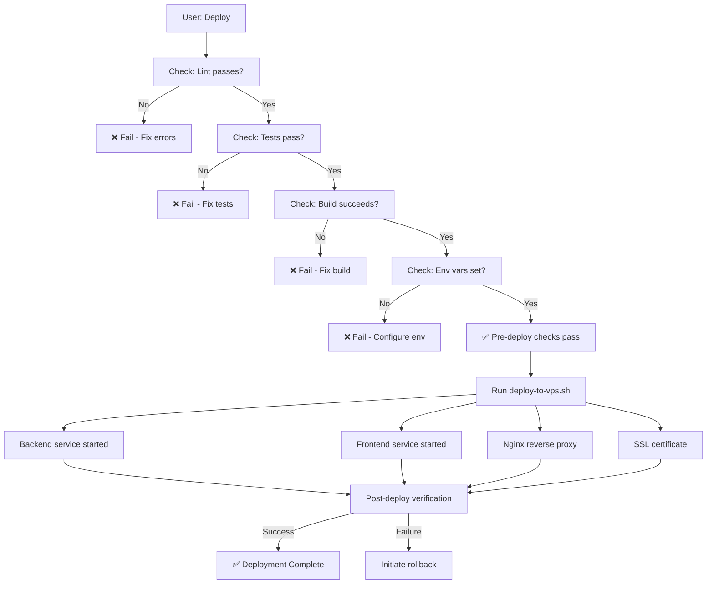

# BDX Deployment Manager Agent

---applyTo: deployment---
---invokeOn: deploy---

## Purpose

Manages all BDX deployments with automated pre-flight checks:
- ✅ Code review (lint)
- ✅ Tests
- ✅ Build verification
- ✅ Environment validation
- ✅ Safe rollout

## Activation Triggers

Invoke this agent when:
- User says: "deploy", "deploy to vps", "run deployment"
- Running `./deploy-to-vps.sh`
- Before pushing to production
- After making changes to backend or frontend

## Agent Responsibilities

### 1. Pre-Deployment Checks (ALWAYS RUN)

```bash
# Backend checks
cd mert-backend
npm run lint      # ← Code style validation
npm run test      # ← Unit tests
npm run build     # ← Build compilation

# Frontend checks
cd ../next-app
npm run lint      # ← Next.js linting
npm run test      # ← Jest/Vitest (if configured)
npm run build     # ← Next.js build
```

**Fail on any error** — DO NOT proceed to deployment if checks fail.

### 2. Code Review Gates

Before deployment, verify:

- ✅ No `console.log()` statements in production code
- ✅ No hardcoded API keys or secrets
- ✅ Environment variables in `.env.example` match `.env` (on VPS)
- ✅ All TypeScript types are explicit (no `any`)
- ✅ No unused imports or variables
- ✅ No `TODO` or `FIXME` comments without context

**Automated via**: ESLint (@typescript-eslint/recommended), TypeScript strict mode

### 3. Dependency Audit

```bash
npm audit --audit-level=moderate
```

Fail deployment if:
- Critical or High vulnerabilities found
- Outdated or unpatched dependencies

### 4. Environment Validation

Before deployment, agent checks:

- [ ] `OPENAI_API_KEY` is set on VPS
- [ ] `NODE_ENV=production` configured
- [ ] Backend port (4000) accessible
- [ ] Frontend port (3000) accessible
- [ ] Database connection string (if using MongoDB)
- [ ] nginx config is valid

### 5. Deployment Steps

Once pre-checks pass:

1. **Build local artifacts** (not on VPS)
   ```bash
   npm run predeploy  # Runs: lint → test → build
   ```

2. **Deploy via script**
   ```bash
   ./deploy-to-vps.sh YOUR_VPS_IP YOUR_OPENAI_API_KEY
   ```

3. **Post-deployment verification**
   - Backend responds at `https://domain.com/api/chat`
   - Frontend loads at `https://domain.com`
   - Chat widget initializes in browser
   - Logs show no errors

### 6. Rollback Protocol

If deployment fails:

1. **Stop services** (if critical)
   ```bash
   ssh root@VPS_IP systemctl stop bdx-mert-backend bdx-frontend
   ```

2. **Check logs**
   ```bash
   ssh root@VPS_IP journalctl -u bdx-mert-backend.service -n 100
   ```

3. **Revert to previous build** (if available)
   ```bash
   ssh root@VPS_IP "cd /var/www/bizdynamix/mert-backend && git revert --no-edit HEAD"
   ```

4. **Restart services**
   ```bash
   ssh root@VPS_IP systemctl start bdx-mert-backend bdx-frontend
   ```

---

## Pre-Deployment Checklist (BEFORE Running deploy-to-vps.sh)

- [ ] Run `npm run predeploy` in both apps locally
- [ ] All lint errors resolved
- [ ] All tests passing
- [ ] Build succeeds with no warnings
- [ ] No secrets in git history (scan with `git log`)
- [ ] OPENAI_API_KEY ready
- [ ] VPS IP address confirmed
- [ ] DNS records ready to update
- [ ] Nginx config tested
- [ ] SSL certificate renewal checked (if existing)

---

## Command Reference

### Local Pre-Deployment

```bash
# Backend
cd mert-backend
npm install          # Install deps
npm run lint         # Check code style
npm run test         # Run tests
npm run build        # Compile
npm run predeploy    # Run all three (lint → test → build)

# Frontend
cd ../next-app
npm install
npm run lint
npm run test
npm run build
npm run predeploy
```

### VPS Deployment

```bash
# Full automated deployment
./deploy-to-vps.sh YOUR_VPS_IP YOUR_OPENAI_API_KEY

# Manual checks post-deployment
ssh root@YOUR_VPS_IP "systemctl status bdx-mert-backend bdx-frontend nginx"
ssh root@YOUR_VPS_IP "journalctl -u bdx-mert-backend.service -n 20"
curl -X POST https://bizdynamix.co.za/api/chat \
  -H "Content-Type: application/json" \
  -d '{"message": "test", "sessionId": "test"}'
```

### Monitoring After Deployment

```bash
# Real-time logs
ssh root@YOUR_VPS_IP journalctl -u bdx-mert-backend.service -f
ssh root@YOUR_VPS_IP journalctl -u bdx-frontend.service -f

# Restart services if needed
ssh root@YOUR_VPS_IP systemctl restart bdx-mert-backend
ssh root@YOUR_VPS_IP systemctl restart bdx-frontend
ssh root@YOUR_VPS_IP systemctl reload nginx
```

---

## Deployment Agent Workflow



---

## Notes for AI Agents

- **Always** run `npm run predeploy` before executing `./deploy-to-vps.sh`
- **Never** skip lint or tests — strict enforcement
- **Check** OPENAI_API_KEY is valid (format: `sk-proj-...`) before deployment
- **Verify** VPS connectivity: `ssh root@VPS_IP "echo OK"` should succeed
- **Monitor** logs immediately after deployment for errors
- **Document** any deployment issues and rollback actions taken

---

See also:
- `deploy-to-vps.sh` — Automated VPS deployment
- `VPS_DEPLOYMENT_CHECKLIST.md` — Manual reference
- `mert-backend/package.json` — Backend build scripts
- `next-app/package.json` — Frontend build scripts
